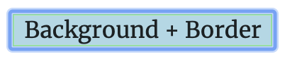
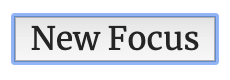
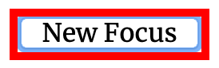
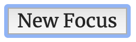

Showing a focus indicator is extremely important for supporting accessible
navigation of your applications and websites. The indicator allows the user to
see the currently focused element on the page while using keyboard navigation
(<kbd>Tab</kbd> to move forward and <kbd>Shift</kbd>+<kbd>Tab</kbd> to move
back).

However, we only want the indicator to appear when the user is relying on
keyboard navigation. If the user is simply clicking the button, a bright focus
ring is unnecessary and can impact the appearance of your app.

When you first add a button to your application, it probably looks something
like this:

<button>Click Me!</button>

<br />

You will notice that your button will not get a focus state when you click on
it. However, pressing the tab key will create a blue outline around the button.
Based on our requirements, this is working perfectly!

## Issue 1 - Chrome removes default behavior

As soon as we try to do a style change like alter the background color or change
the border, something terrible happens in Chrome.

<button style="background-color: lightblue; border-color: lightgreen">
  Background + Border
</button>

<br />

If you click that button on Chrome, you will see something like this:



Well... now it seems to have a blue focus ring even without using tab. Now,
whenever a button is clicked it will get a blue ring around it. Ideally, we only
want the ring to appear when the user is tabbing.

## Issue 2 - Unable to change defaults

Another issue is that there is no way to re-style this default focus state. In
order to improve the appearance of your app, you might want to style the focus
state of your buttons. In this case, let's say you want to change the focus ring
color to red, so you add the following style:

```css
.button-style-focus:focus {
  outline: red auto 5px;
}
```

Here's a button with that style applied:

<button class="button-style-focus">New Focus</button>

<br />

And here's the appearance when you focus it using tab:

<b style="text-align: center; display: block; margin-bottom: -1.5rem">Chrome:</b>



<b style="text-align: center; display: block; margin-bottom: -1.5rem">Firefox:</b>



<b style="text-align: center; display: block; margin-bottom: -1.5rem">Safari:</b>



As you can see, that made no impact on Safari or Chrome, and did not have the
intended effect on Firefox, as it simply added an additional focus ring.

## Super easy solution

There's actually a really simple solution, and it comes with some good and bad
news.

**Solution:** Use the `:focus-visible` pseudo class in your CSS.

**Good news:** This completely resolves the issue! You can use it to apply focus
styles only when the element is focused using navigation.

**Bad news:** At the time of this post, it has
[terrible support across all browsers](https://caniuse.com/#feat=css-focus-visible).

So... looks like we will have to figure something else out. The best solutions
are the ones that most closely mimic the browser's default behavior: show the
focus ring only when the user is keyboard navigating.

## Solution 1 - Just JavaScript

Our first solution involves listening for keyboard and mouse activity, and
changing a data attribute on `<html>` depending on whether the user is tabbing
or not.

```js
function onTab(event) {
  if (event.key === 'Tab') {
    document.documentElement.setAttribute('data-tabbing', 'true');
    window.removeEventListener('keydown', onTab);
    window.addEventListener('mousedown', onMouse);
  }
}

function onMouse() {
  document.documentElement.removeAttribute('data-tabbing');
  window.removeEventListener('mousedown', onMouse);
  window.addEventListener('keydown', onTab);
}

window.addEventListener('keydown', onTab);
```

Once you've done this, you can style your button to only show the focus state
when `data-tabbing` is true:

```css
.custom-focus-button {
  outline: none;
  border: none;
  border-radius: 8px;
  padding: 8px 32px;
  background-color: rgb(21, 39, 100);
  color: white;
}

.custom-focus-button:active {
  background-color: rgb(41, 68, 158);
}

html[data-tabbing='true'] .custom-focus-button:focus {
  box-shadow: 0 0 0 4px rgba(20, 110, 170, 0.4);
}
```

Finally add the class to an HTML button:

```html
<button class="custom-focus-button">Vanilla Custom Focus</button>
```

To view the result, click the CodeSandbox button below, which will only show the
focus state when the user tabs to it.

[](https://codesandbox.io/s/tender-varahamihira-2o9u8?fontsize=14&hidenavigation=1&theme=dark)

## Solution 2 - A React hook

The previous way works pretty well. However, the need for a global data
attribute can be entirely avoided by creating a React hook. This hook may simply
return a boolean for whether the user is currently tabbing. This also allows
more control over how that value is used. For example, you could optionally set
a class on a component if the user is tabbing, rather than observing the html
data attribute in the CSS.

To start, we are going to create an observable class:

```js
class UserTabbingObservable {
  constructor() {
    this._subscribers = [];
    this.isUserTabbing = false;
  }

  subscribe(subscriber) {
    const exists = this._subscribers.includes(subscriber);
    if (!exists) this._subscribers.push(subscriber);
    return this._unsubscribe(subscriber);
  }

  _unsubscribe(subscriber) {
    return () => {
      this._subscribers = this._subscribers.filter(s => s !== subscriber);
    };
  }
}
```

This is personal preference, but it provides an easy way for individual hook
instances to subscribe to the listener results.

Next, we are going to add the same JavaScript listeners, as well as some checks
when new subscribers are added, or all subscribers are removed.

```js{8-15,24-25,29-59}
class UserTabbingObservable {
  constructor() {
    this._subscribers = [];
    this.isUserTabbing = false;
  }

  subscribe(subscriber) {
    // If adding first subscriber, begin listening to window.
    if (this._subscribers.length === 0) {
      if (this.isUserTabbing) {
        this._tabToMouseListener();
      } else {
        this._mouseToTabListener();
      }
    }
    const exists = this._subscribers.includes(subscriber);
    if (!exists) this._subscribers.push(subscriber);
    return this._unsubscribe(subscriber);
  }

  _unsubscribe(subscriber) {
    return () => {
      this._subscribers = this._subscribers.filter(s => s !== subscriber);
      // If no subscribers, stop listening to window.
      if (this._subscribers.length === 0) this._removeAllListeners();
    };
  }

  _setIsUserTabbing(isUserTabbing) {
    this.isUserTabbing = isUserTabbing;
    this._subscribers.forEach(subscriber => subscriber());
  }

  _handleFirstTab = event => {
    if (event.key === 'Tab') {
      this._setIsUserTabbing(true);
      this._tabToMouseListener();
    }
  };

  _handleFirstMouse = () => {
    this._setIsUserTabbing(false);
    this._mouseToTabListener();
  };

  _tabToMouseListener() {
    window.removeEventListener('keydown', this._handleFirstTab);
    window.addEventListener('mousedown', this._handleFirstMouse);
  }

  _mouseToTabListener() {
    window.removeEventListener('mousedown', this._handleFirstMouse);
    window.addEventListener('keydown', this._handleFirstTab);
  }

  _removeAllListeners() {
    window.removeEventListener('mousedown', this._handleFirstMouse);
    window.removeEventListener('keydown', this._handleFirstTab);
  }
}
```

The reason for creating an observable class is that we can instantiate it a
single time and then subscribe and unsubscribe hooks as they are created /
unmounted. The actual hook will be quite simple, it will merely subscribe to a
single instance of this observable class, and return a boolean:

```js
const observable = new UserTabbingObservable();

export function useTabbing() {
  const [isUserTabbing, setIsUserTabbing] = useState(observable.isUserTabbing);

  useEffect(() => {
    const setTabbing = () => setIsUserTabbing(observable.isUserTabbing);
    return observable.subscribe(setTabbing);
  }, []);

  return isUserTabbing;
}
```

Now you can use the hook in a button component to change the class whenever the
user is tabbing:

```js
import classnames from 'classnames';
import React from 'react';
import {useTabbing} from './useTabbing';
import './button.css';

export default function Button({className, ...props}) {
  const isUserTabbing = useTabbing();

  const buttonClass = classnames('custom-focus-button', {
    'custom-focus-button--focus': isUserTabbing,
  });

  return <button {...props} className={buttonClass} />;
}
```

Where the CSS is a slight variation on the style from the JavaScript section:

```css{14-16}
.custom-focus-button {
  outline: none;
  border: none;
  border-radius: 8px;
  padding: 8px 32px;
  background-color: rgb(21, 39, 100);
  color: white;
}

.custom-focus-button:active {
  background-color: rgb(41, 68, 158);
}

.custom-focus-button--focus:focus {
  box-shadow: 0 0 0 4px rgba(20, 110, 170, 0.4);
}
```

And that's it! No matter your approach, finding a solution to this puzzle will
allow you to satisfy both the design element and the accessibility of your app.
Below is a Code Sandbox of the React solution in action. Try playing around with
different styles.

[](https://codesandbox.io/s/react-keyboard-focus-styles-0b2i5?fontsize=14&hidenavigation=1&theme=dark)
